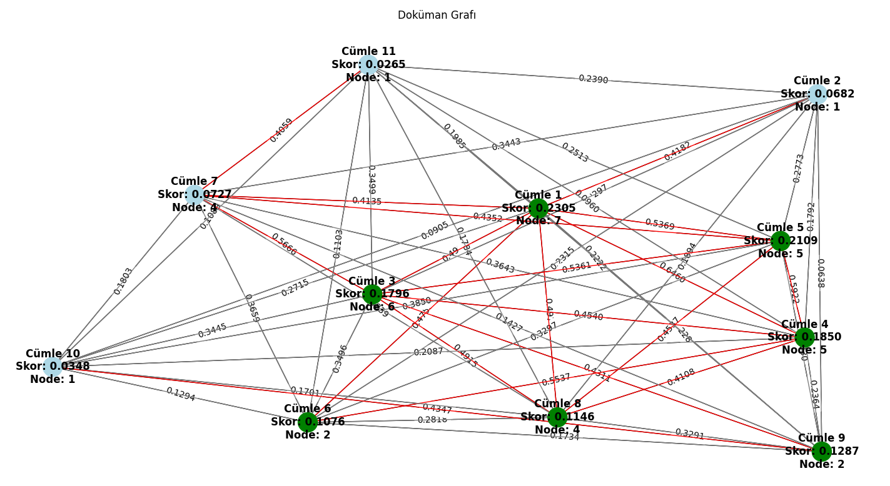
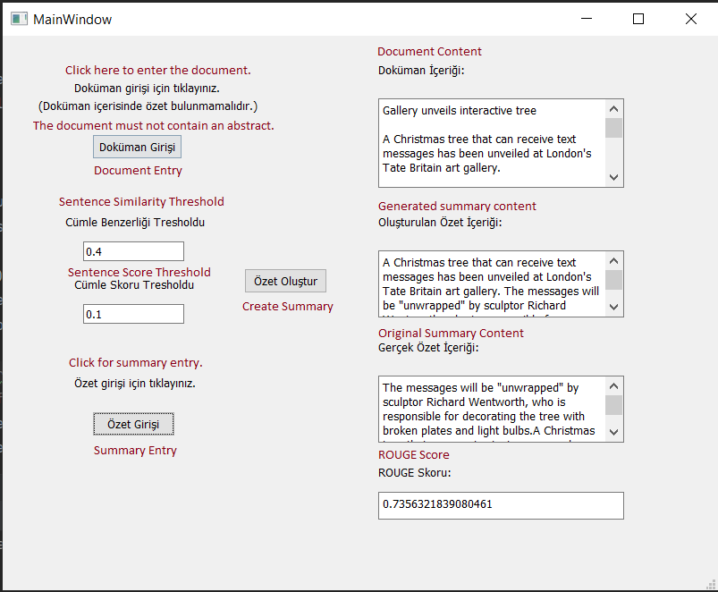

# Document Summarization

## 📖 Project Description

In this project, the sentences in a given document were converted into a graph structure and this graph model was visualized. An Extractive Summarization algorithm was developed using the nodes of the graph.

The generated summary was compared with the reference summary, and its performance was evaluated using ROUGE scores.

## 📝 Project Features

- A desktop application was developed.  
- Users can upload and read documents.  
- Sentences in the document were converted into a graph and visualized.  
- Semantic relationships between sentences were calculated using the BERT model.  
- Sentence scoring was performed, and important sentences were selected to generate the summary.  
- The generated summary was compared with the reference summary, and ROUGE scores were calculated.  

---

## 🔎 Sentence Processing and Algorithms

The following preprocessing steps were applied to sentences:  
- Tokenization  
- Stemming  
- Stop-word elimination  
- Punctuation cleaning  

Sentence similarity was calculated using BERT and Cosine Similarity methods.  

---

## Sentence Score Calculation

The parameters calculated for each sentence were:  
- **P1:** Number of proper nouns / sentence length  
- **P2:** Number of numerical values / sentence length  
- **P3:** Node connections above the threshold / total number of connections  
- **P4:** Number of words in the title / sentence length  
- **P5:** Number of TF-IDF theme words / sentence length  

These parameters were used to determine the sentence score for each node.  

---

## Summarization

- Summaries were generated using the Extractive Summarization method.  
- The order of sentences was preserved in the summary.  
- Important sentences were selected based on node scores.  
- The generated summary was displayed in the desktop interface.  

---

## ROUGE Score

The generated summary was compared with the reference summary, and ROUGE scores were calculated. This allowed measuring the accuracy of the summarization algorithm.  

---

## Outputs

- Graph visualization generated from the uploaded document  

  

- Summary text generated by the algorithm  
- ROUGE score table comparing the generated summary with the reference summary  

  

Example screenshots are available in the `images/` folder.
